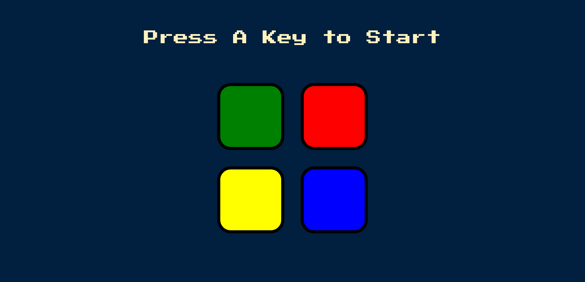

# The Simon Game

This is a solution to the Boss Level Challenge 2 from The Complete 2022 Web Development Bootcamp on Udemy by Angela Yu[Coding bootcamp testimonials slider challenge on Frontend Mentor](https://www.frontendmentor.io/challenges/coding-bootcamp-testimonials-slider-4FNyLA8JL).

## Table of contents

- [Overview](#overview)
  - [Game Rules](#game-rules)
  - [Screenshot](#screenshot)
  - [Links](#links)
- [My process](#my-process)
  - [Built with](#built-with)
  - [What I learned](#what-i-learned)

## Overview

### Game Rules

- Press any button to start the game
- Game will give the first signal
- Click on the same box to go to the next level
- Game will add another signal
- You need to repeat the correct pattern
- Continue playing as long as you can repeat the sequence
- Good luck!👍

### Screenshot

### Links

- Solution URL: [Code](https://github.com/waldekglaz/Simon-Game)
- Live Site URL: [Live Game](https://waldekglaz.github.io/Simon-Game/)

## My process

### Built with

- Html and Css has benn provided by Angela Yu
- jQuery

### What I learned

This is my first jQuery project and it was good fun. Learn how to:

- select DOM elements with jQuery
- manipulate CSS styles with jQuery
- manipulate text with jQuery
- manipulate attributes with jQuery
- add event listeners with jQuery
